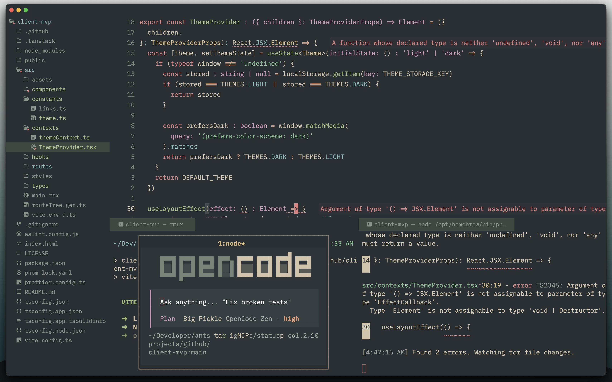

# Zed Editor Configuration

> **NOTE**
> This repository is an **archival record** of the configuration.  
> It is no longer updated. For the current version, see the official Gist:  
> ➡ [Zed configuration Gist](https://gist.github.com/nvimcraft/eff4fce336ed7e7e4c52e07641ac57ef)



This repository contains a maintained configuration for the Zed editor.

It is kept public to track changes over time and to serve as a concrete,
working configuration—not a template or recommendation.

## Why This Exists

This repository is used to:

- Keep a clear record of how the configuration evolves
- Make intentional, reviewable changes instead of drifting defaults
- Reproduce the same environment on new machines
- Share a concrete reference for people who value minimal UI

## What This Configuration Covers

This configuration includes:

- Typography choices (UI, buffer, and agent fonts)
- Core editor behavior (Vim mode, line numbers, tab size)
- Visibility and behavior of panels, toolbars, and window chrome
- Theme and icon theme selection
- A small set of quality-of-life defaults

Commits are kept small and scoped. The commit history is part of the documentation.

### Fonts

The configuration is designed around **Lilex Nerd Font**.

On macOS, it can be installed with Homebrew:

```bash
brew install font-lilex-nerd-font
```

Other Nerd Fonts should work as well, though spacing and glyph alignment may vary.

## Keybindings

Custom keybindings (`keymaps.json`) are intentionally not included.
Parts of the Neovim
[keybindings](https://github.com/nvimcraft/dotfiles-macos/tree/main/.config/nvim/lua/config/keymaps)
may be migrated later.

## Non-Goals

This repository is intentionally not trying to:

- Represent best practices for all Zed users
- Cover every available setting
- Enforce a specific workflow or layout
- Act as a polished or branded configuration pack

It is a maintained configuration reflecting specific preferences.

---

> **NOTE:**
> For the Neovim (nightly) configuration and broader editor setup,
> [see](https://github.com/nvimcraft/dotfiles-macos/tree/main/.config/nvim)
